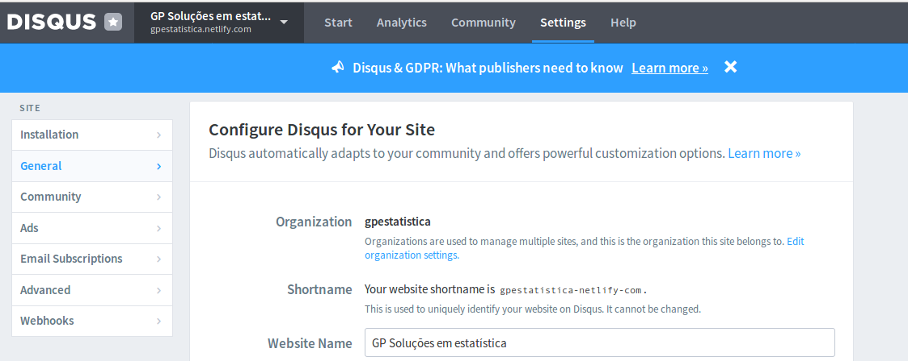

```{r setup, include=FALSE}
library(knitr)
opts_chunk$set(
    tidy = FALSE, 
    results = "markup", # hold
    fig.path = "graficos/",
    dpi = 100,
    fig.align = "center",
    fig.show = "asis", # hold
    comment = NA,
    warning = FALSE,
    cache = TRUE,
    echo = FALSE)
options(width = 1000)
#Opção global de chunck
options(scipen = 4, digits = 5) # Isso fala que, o inline terão 5 dígitos e não será
options(table_counter = TRUE, width = 10000)
options(figure_counter = TRUE, width = 10000)
```

+ O comando `blogdown::serve_site` renderiza o site todo (Tu precisa estar no diretório do site):
    + Se tu roda essa função, e o site não atualiza, pode ser outro erro. Aí, tu pode rodar `hugo -v` no terminal de comando e ele dá a descrição do erro.
+ O comando `blogdown::build_site` compila os arquivos `.Rmd`;
+ Figuras que não foram criadas dentro de um arquivo .Rmd tem que estar no diretório `Site/static/img/banners`;
+ Figuras criadas dentro do arquivo .Rmd não devem ter um `fig.path` assinalado. Automaticamente o blogdown coloca as figuras no local correto;
+ Para adiconar figura dentro do arquivo .Rmd é necessário passar o caminho completo. Para passar no cabeçalho do arquivo, pode passar o caminho curto.
+ Após criar um lugar para hospedar o site (web server), atualize o `baseurl` no config.toml para que seja possível *to deploy* o site.
+ Para adicionar *comentários* é necessário criar uma conta no Disqus. Após isso no caminho `~/themes/hugo-universal-theme/layouts/partials` é necessário criar o arquivo `disqus.html` e colocar o código disponível no seguinte link: https://github.com/rstudio/blogdown/issues/52#issuecomment-288407836 nesse arquivo. Aí, é necessário trocar o `larnsce` dentro do `s.src = 'https://larnsce.disqus.com/embed.js';` pela chave do endereço criado pelo disqus (shortname) `https://gpestatistica-netlify-com.disqus.com/admin/settings/general/` bem como no arquivo `config.toml` é necessário utilizar a mesma chave (shortname). Após logar no disqus, foi necessário clicar em Admin -> Settings. Segue foto:



+ Eu posso excluir a pasta `exampleSite`?
+ Quando eu coloco "!" antes do link da figura/outro relatório, ele indica que eu quero abrir o arquivo em si. Sem o "!" ele apenas linka o arquivo, isto é, não abre ele. Ex: Usar [Criando uma base de dados](/blog/criaBase) para linkar o post criaBase dentro de um arquivo. Para abrir o arquivo, teria que fazer: . No entanto, ao fazer isso o arquivo não abre (apenas aparece uma espaço em branco). Mas ao utilizar  obviamente, renderiza a imagem.


# Como criar um bom relatório

- Sempre escreva aquilo que não é óbvio! (Ou seja, o que você teve que pensar para analisar);
- Nomeie as figuras/tabelas nos relatórios;
- Conclua: faça direções sobre os resultados;
- Escreva as limitações do estudo;
- Escreva (quando imposto), o porque de não ter utilizado outra metodologia;
- Explique quando necessário for, os conceitos no relatório (blog).

# Referências